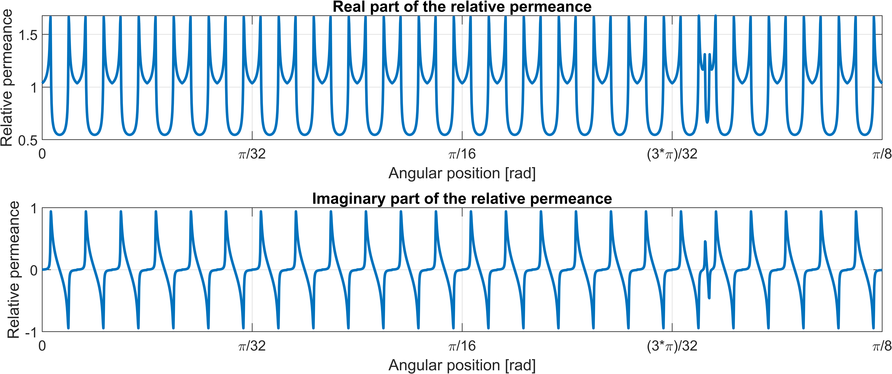
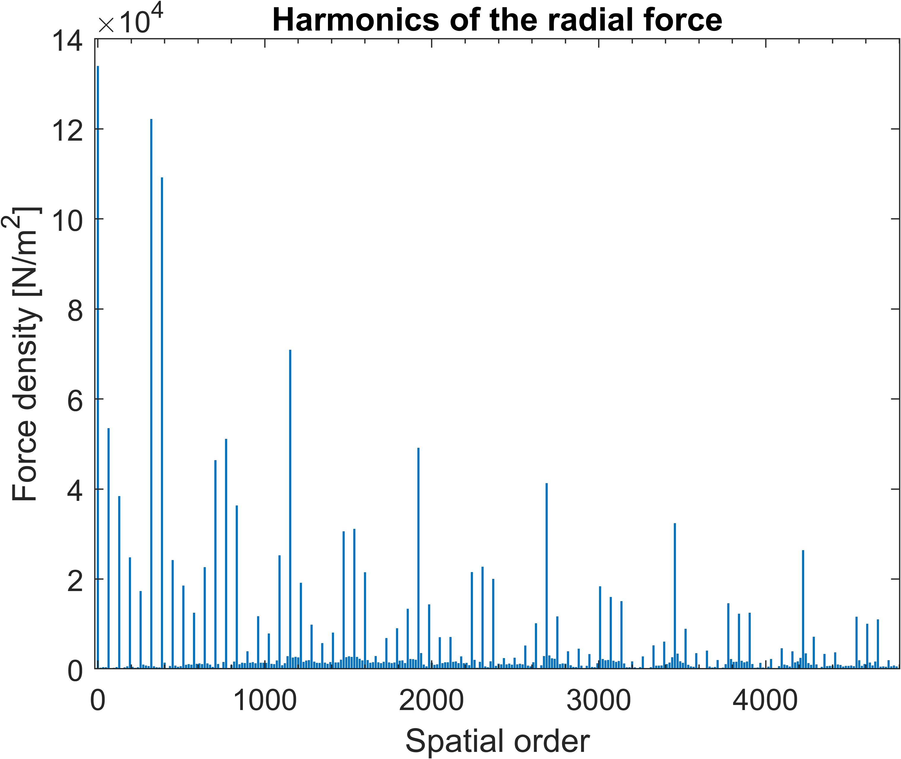
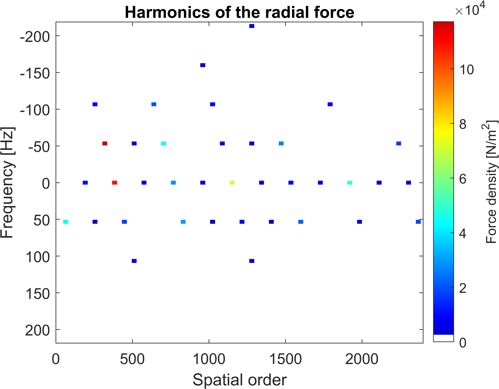
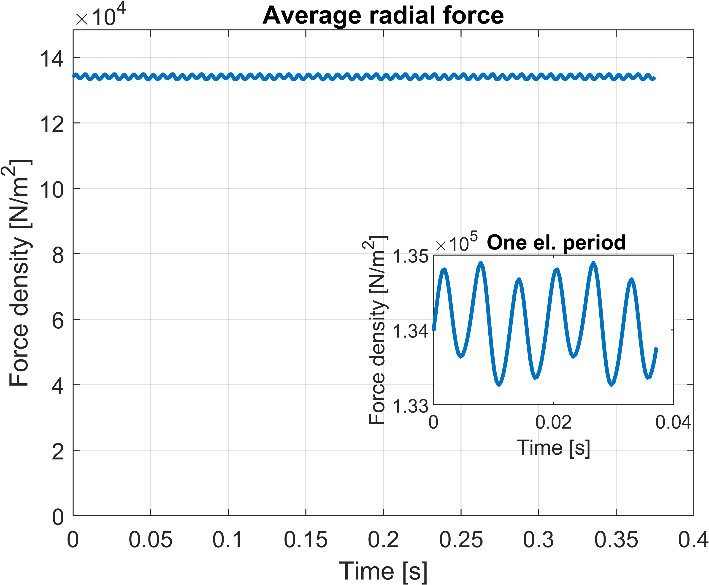
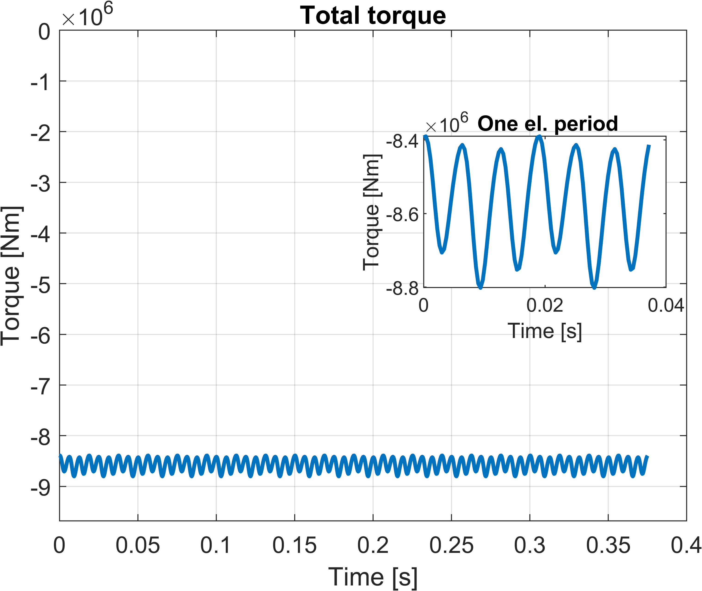
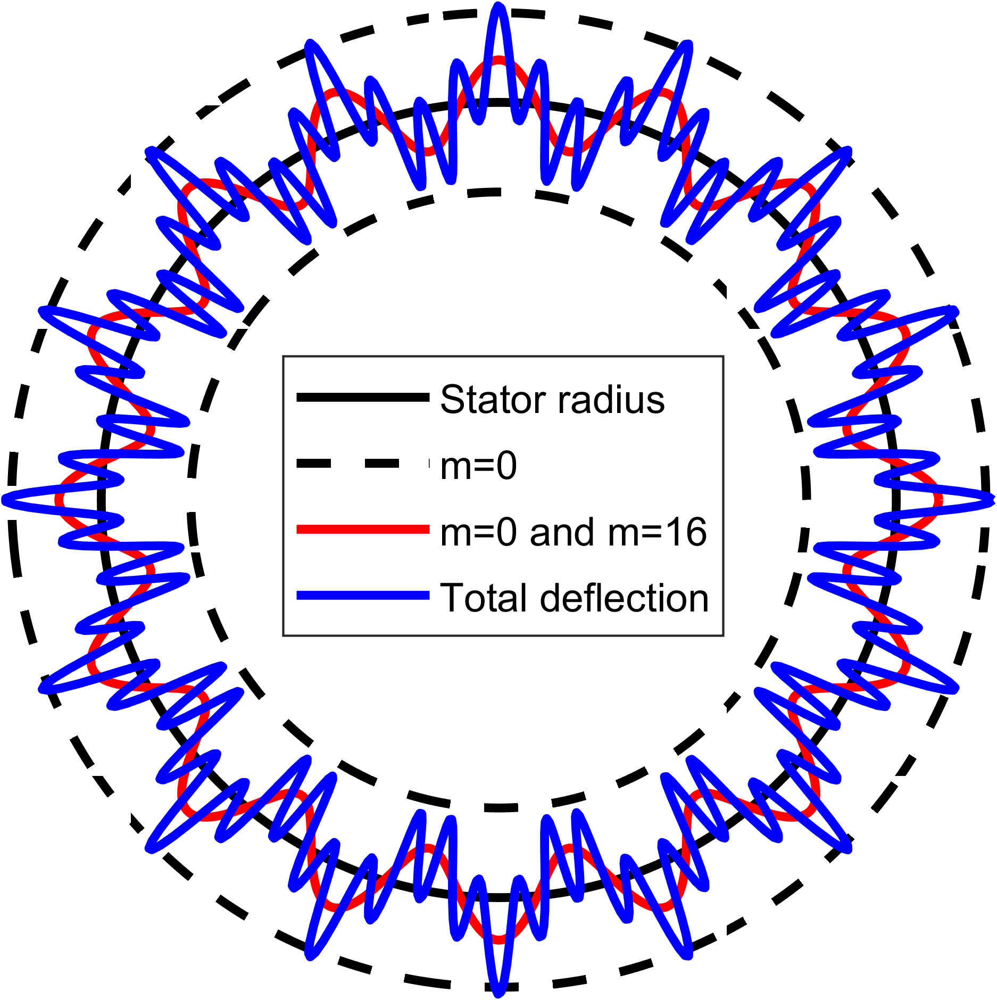

# Script to analyze force harmonics in a segmented PM machine

This script is used for my Master Thesis at the TU Delft, called *Forces and Vibrations in a Modular HVDC machine*.
It aims to set up an analytical model of the magnetic flux density distribution in the air gap, and apply Maxwell's stress tensor to obtain the resulting forces.

The method is based on *Noise in Polyphase Electric Motors* By J.F. Gieras, 2D magnetic flux models by Z.Q. Zhu, and work by Jean Le Besnerais and Mostafa Valavi. 
The complex relative permeance function is based on the papers by Damir Žarko, and other references can be found in the thesis report.

Casper Klop, July 2022

---
The specific machine type assumed in this script is a Surface-mounted PM machine with Fractional-Slot Concentrated Windings, with the stator segmented in multiple 3-phase sections.
The model is tested with the parameters set in [Set_params.m](Set_params.m), but effort is put in parametrizing all equations so other models can be analyzed as well. Implicit, underlying assumptions in some of the equations might result in errors if another machine is analyzed.

It is assumed that all segments are equal, and all calculations are done for one segment only.

## Flux density calculations
The magnetic flux density is calculated close to the stator inner radius, as the thesis is focused on calculating the forces acting on the stator segments.
First, the magnetic flux density resulting from the Permanent Magnets is calculated in [B_PM_slotless.m](B_PM_slotless.m), assuming a slotless stator, which only has a radial component:

Second, the magnetic flux density resulting from the armature reaction is calculated in [B_arm_slotless.m](B_arm_slotless.m), assuming a slotless stator, which has both a radial and a tangential component (onyl radial shown here):

Neglecting saturation, the total magnetic flux density for a slotless machine is calculated by the linear superposition of the two magnetic fields. 
A brief analysis of the influence of time harmonics due to Power Electronic Converters is performed as well in [B_arm_slotless_PE.m](B_arm_slotless_PE.m), but this is quite preliminary.

## Influence of slots and segment gaps
The influence of the slots is taken into account by calculating the complex relative permeance, using the methods described by Damir Žarko. The equations resulting from the conformal mapping described in his paper are solved numerically in [Zarko.m](Zarko.m). 
The same can be done to take into account a small gap in between the segments, by analyzing a narrow slot in between very wide teeth. The effect of the slots and segment gap is superimposed, as shown below:

The slotted flux density is calculated by multiplying the slotless flux density by the complex conjugate of lambda, resulting in the radial and tangential slotted flux density shown below:

## Resulting forces
By using Maxwell's stress tensor for magnetic fields in a radial coordinate system, the radial and tangential forces on one segment are calculated:

As this force is a superposition of many force orders at different frequencies, a Fast-Fourier Transform is used to decompose the forces.
This can be done purely for the spatial orders:

Or in 2D, showing the frequencies at which the spatial orders occur:

The zeroth order is found by calculating the variation in the DC component of the force over time:

## Torque calculations
Only flux density harmonics of the same spatial order generate useful torque; this is analyzed for the no-load case in [cogging_torque.m](cogging_torque.m):

And for the on-load torque simply by taking the average tangential force and multiplying this by an arm of R_s:

## Mechanical analysis
An analytical estimate of the eigenfrequencies for different eigenmodes is calculated in [Natural_frequencies.m](Natural_frequencies.m). This is done for (systems of) simple ring models for both the stator core and the frame. The results are exported in a table.

The quasi-static deformation caused by the calculated radial forces is calculated in [deformation.m](deformation.m) for the stator core and in [deformation_sys.m](deformation_sys.m) for the stator-frame system. The results are visualized in [deform_plot.m](deform_plot.m):

## Export of results
The plots are exported in EPS in [Figures](Figures). GIFs are created in [make_gif.m](make_gif.m) using the gif toolbox from Chad Greene.
Finally, frequency-domain forces can be exported with [export_force.m](export_force.m), which in this thesis was used to apply to a 3D mechanical model in COMSOL.

